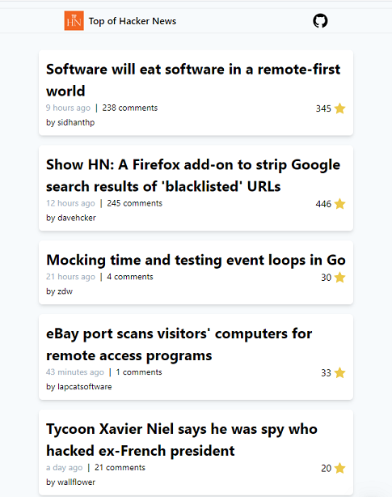

<h1>Hacker news custom UI</h1>

Made with :
- Nextjs
- Tailwindcss
- SWR

Made live on twitter, check out the [thread here](https://twitter.com/melbarchany/status/1264239873696940033)

TODO :

- [ ] Add header and footer
- [ ] Add manifest for pwa
- [ ] Add SEO metas
- [ ] Add dark mode (might be the default)

Based on the [amazing API](https://github.com/cheeaun/node-hnapi/) of @cheeaun
